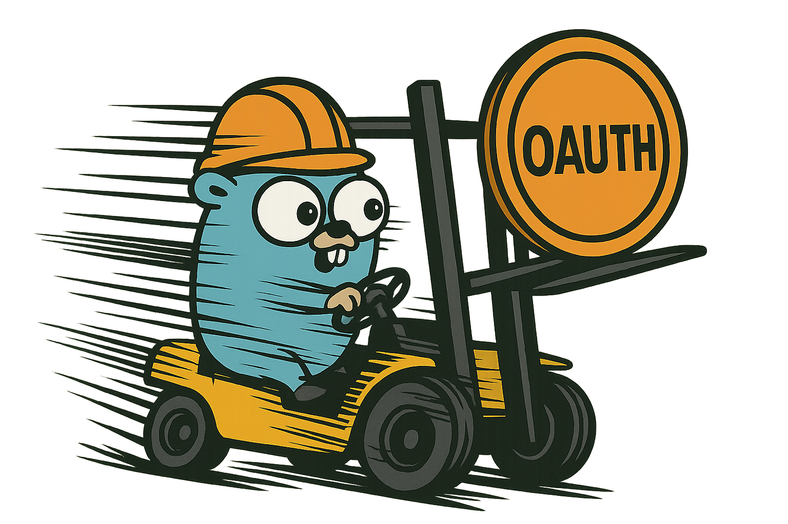

GoToken is a specialized Go library for OAuth token management that automatically refreshes tokens every 59 minutes (before the standard 60-minute expiry) and provides them to HTTP requests without requiring additional authentication requests.

## Features

- **Automatic Token Lifecycle Management**: Generates tokens once and refreshes them before expiry
- **59-Minute Refresh Cycle**: Automatically refreshes tokens before the standard 60-minute expiry
- **Zero-Overhead HTTP Integration**: Passes tokens to HTTP headers without additional authentication requests
- **Thread-Safe Token Access**: Safe for concurrent use across multiple goroutines
- **Configurable Options**: Customize refresh timings and token event callbacks

## Project Structure

```
gotoken/
├── cmd/
│   └── gotoken/         # Executable application
│       └── main.go      # Example usage of OAuth token management
├── pkg/
│   └── oauth/           # OAuth token handling
│       ├── token.go     # Token providers implementation
│       └── manager.go   # Token lifecycle management
└── go.mod              # Go module definition
```

## Usage Example

```go
// Create a token provider
provider := &oauth.ClientCredentialsProvider{
    TokenURL:     "https://example.com/oauth/token",
    ClientID:     "your-client-id",
    ClientSecret: "your-client-secret",
    Scope:        "read write",
}

// Create a token manager that will automatically:
// 1. Generate a new token with a POST request
// 2. Refresh tokens every 59 minutes (before the standard 60-minute expiry)
// 3. Apply tokens to all HTTP requests without additional POST requests
tokenManager := oauth.NewTokenManager(provider,
    // Explicitly set refresh time to 59 minutes
    oauth.WithRefreshTime(59*time.Minute),
    // Set buffer time in case you're not using fixed interval
    oauth.WithBufferTime(1*time.Minute),
    // Get notified when a new token is obtained
    oauth.WithOnNewToken(func(token *oauth.TokenResponse) {
        log.Printf("New token obtained, will be refreshed in 59 minutes")
    }),
)

// Wait for initial token to be ready
tokenManager.WaitForToken()

// Apply token to HTTP requests
req, _ := http.NewRequest("GET", "https://api.example.com/resources", nil)
tokenManager.ApplyToRequest(req)
```

## Getting Started

1. Clone the repository
2. Run `go mod tidy` to ensure dependencies are correctly set up
3. Explore the provided examples in the cmd/gotoken directory

## Requirements

- Go 1.18 or higher
- Make sure Go binary directories are in your PATH (typically /usr/local/go/bin or /usr/lib/go-1.18/bin)
